# vantage

**BMP-based routing observability, rebuilt in Go.** Routers stream their
routing tables and session events to vantage over BMP (RFC 7854); vantage
decodes them into typed protobuf, carries them on NATS JetStream, archives
them in ClickHouse, and serves them through a read API and a web UI.

IPv4 and IPv6 unicast, VPNv4 and VPNv6, labeled unicast, EVPN and BGP-LS are
decoded into typed rows, not kept as opaque bytes. Known vendor quirks are
handled per vendor, and every row carries a parse-flag field recording
anything the decoder could not type. A peer's four BMP views, pre- and
post-policy Adj-RIB-In and pre- and post-policy Adj-RIB-Out (RFC 8671), stay
four separate answers rather than being blurred into one.

## Why it exists

It is a ground-up replacement for the abandoned OpenBMP ecosystem. No wire
compatibility with legacy OpenBMP is retained, and none is planned.

The design principle behind every screen: **an answer states its own
limits.**

- A result fetched a page at a time says so. The table can change between
  pages, so rows may repeat or go missing, and the screen tells you instead
  of passing the result off as a snapshot.
- A peer still sending its initial table dump is marked `provisional`, not
  counted as settled.
- When a collector stops hearing from a session, the peer reads `view lost`:
  the collector's own blindness. That is a different fact from the router
  reporting the BGP session `down`, and no screen merges the two.
- When a collector itself goes quiet and stops sending heartbeats, its
  routes are still served, but marked `stale` and carrying a warning, rather
  than passed off as current or silently dropped.
- An empty chart says it has no rows instead of rendering as a gap.

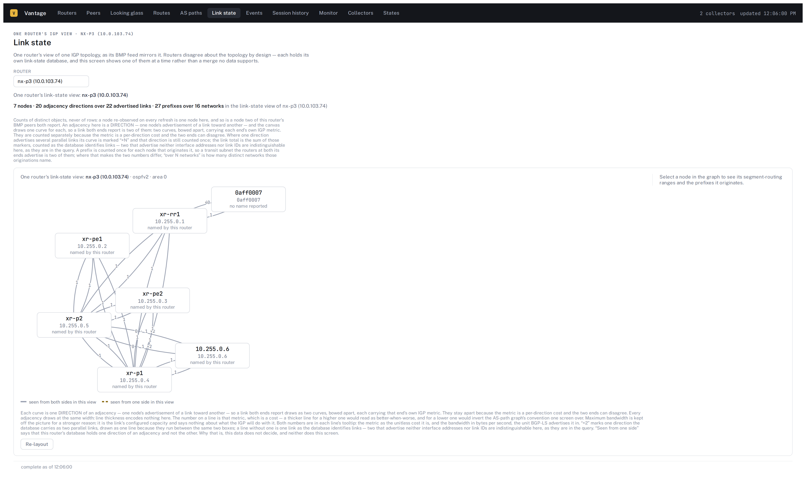

*`nx-p3`'s own link-state database — 7 nodes, 20 adjacency directions over 22
advertised links, 27 prefixes over 16 networks, ospfv2 area 0. Each curve is
one **direction** of an adjacency carrying that end's own IGP metric, so a
link both ends advertise draws as two curves that are free to disagree.
Routers disagree about topology by design; this screen shows one router's
database at a time rather than a merge no data supports.*

## The screens

Six screens, and the question each one answers.

### 1. Looking glass — who sees this prefix, and by what path

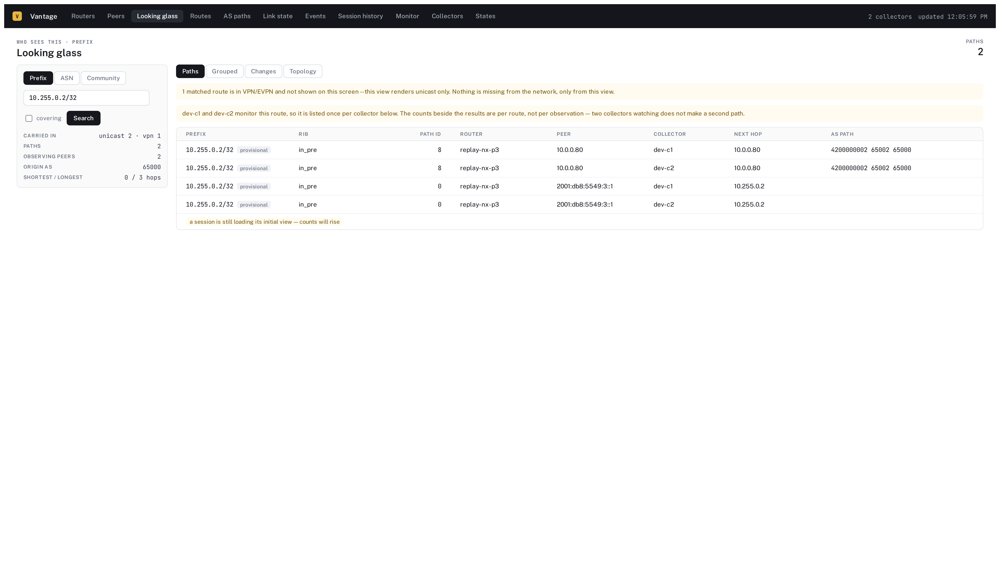

Search by prefix, ASN or community. Here `10.255.0.2/32` resolves to 2 paths
across 2 observing peers, listed once per collector, with the origin AS and
the shortest and longest path lengths summarized alongside. Two disclosures
are doing real work: one matched route is carried in VPN/EVPN and is
excluded from a unicast view — the screen says so instead of quietly
dropping it — and the counts are per route, so two collectors watching the
same route do not make a second path.

### 2. AS paths — the force-directed graph

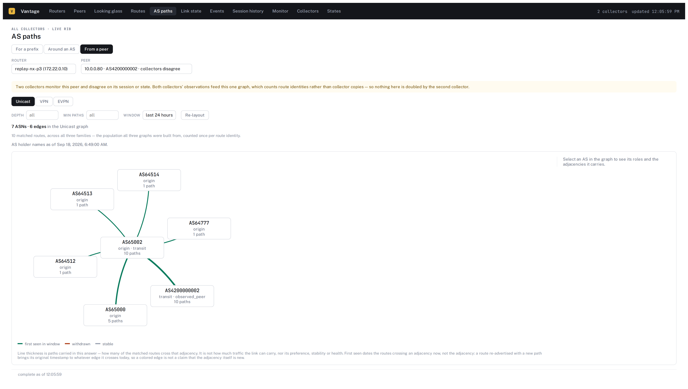

The AS-path graph for one prefix, one AS's neighborhood, or one peer's whole
view. Here: 7 ASNs and 6 edges around AS65002, built from 10 matched routes
across all three families, with each node's roles (origin, transit, observed
peer) and path count on it. Line thickness is paths carried, and the screen
says outright that it is not bandwidth, preference or health.

Two collectors monitor this peer and disagree about its session. Both feed
this one graph, which counts **route identities rather than collector
copies** — adding an observer does not inflate the network. That
cross-collector arithmetic is easy to get wrong and expensive to notice.

### 3. Peers — the fleet at a glance

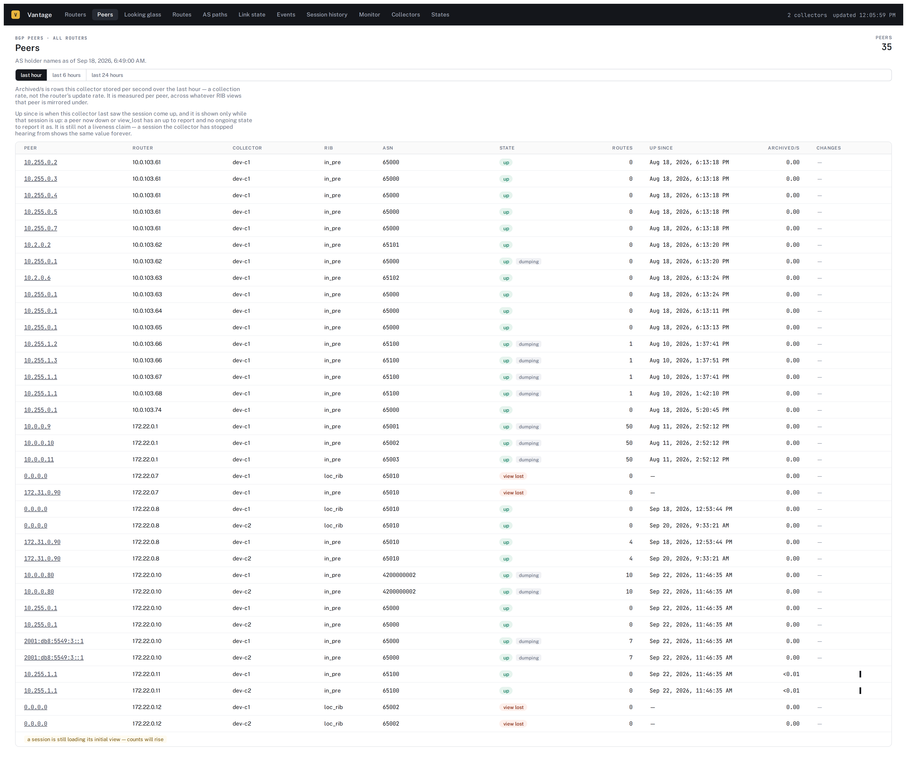

Every BGP peer every collector can see, 35 rows here across all routers and
both collectors, with state (`up`, `down`, `view lost`, `stale`), a
`dumping` mark while the initial table is still arriving, route count,
`Up since`, an archived-rows-per-second rate and a per-peer `Changes`
sparkline. `Up since` shows only while the session is up or stale. A session
the collector has stopped hearing from would otherwise show the same time
forever, and that would read as a claim that it is still up.

### 4. Link state — one router's IGP view

Shown at the top of this page. Pick a router and walk its BGP-LS database:
nodes, adjacencies with per-direction metrics, and the prefixes each node
originates. Adjacencies seen from only one side are drawn differently from
those both ends report.

### 5. Monitor — the dashboard

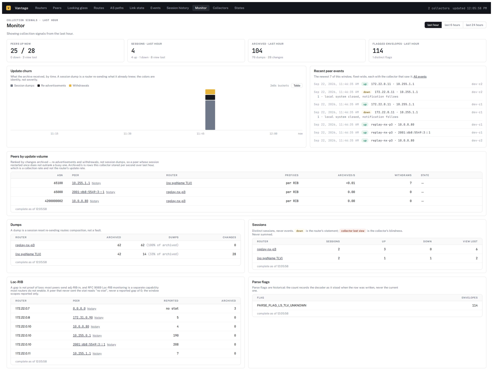

Collection signals over a window: 25 of 28 peers up (0 down, 3 view lost), 4
sessions in the last hour, 104 rows archived (76 dumps, 28 changes), and 114
envelopes carrying a parse flag. The churn chart splits what arrived by
identity — session dumps, re-advertisements, withdrawals — because a peer
whose session restarted is not a peer whose network moved, and ranking them
together would put the wrong peer at the top.

### 6. Collectors — what each daemon says about itself

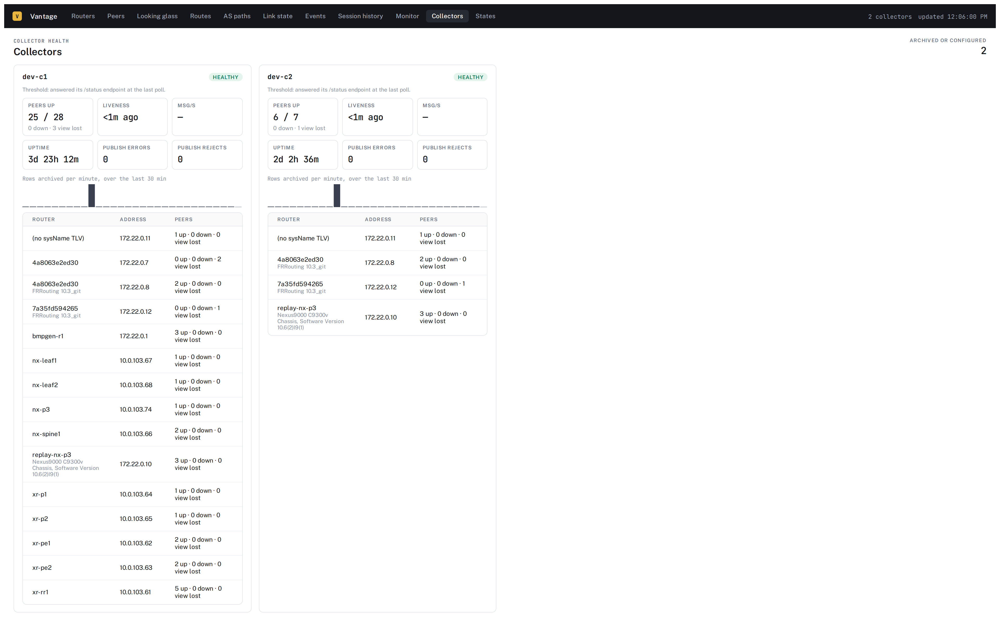

Each collector's own `/status`: peers up, its last heartbeat, uptime,
publish errors and rejects, rows archived per minute, and the routers it is
hearing from with whatever `sysDescr` each one sent. A collector that is not
answering is reported as not answering, rather than inferred from an absence
of rows.

## Screen reference

The other five screens, in brief. (The nav bar in every screenshot on this
page also carries States, a design reference exercising every `DataTable`
state rather than an operator screen, and not covered here.)

| Screen | What it is for |
| --- | --- |
| **Routes** | One peer's table, walked through one collector. |
| **Events** | Peer events fleet-wide over a window, newest first. |
| **Session history** | One (router, peer) pair's events, over windows out to the configured history retention (90 days by default). |
| **Routers** | Every BMP router each collector has seen, with up/down/view-lost peer counts and last-seen. |
| **Peer detail** | One peer: session identity, negotiated families, dump progress, churn. |

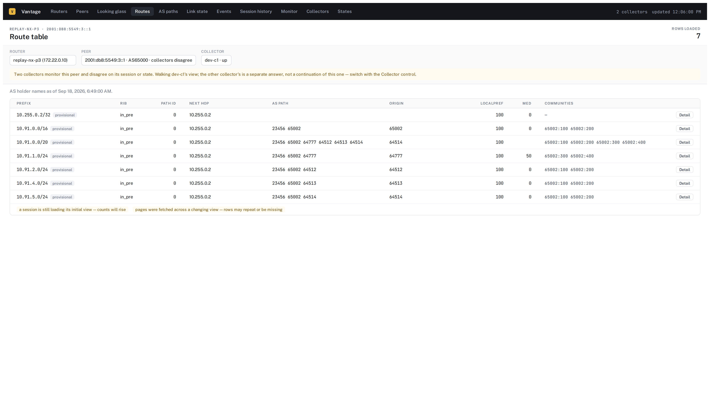

*Routes, for one peer through one collector: 7 rows, 5 origin ASNs, varied
communities and MED, and `AS23456` (AS_TRANS) standing in for a 4-byte ASN
in the paths. Both footer notes are structural rather than incidental. The
`provisional` tags are correct — these routes arrived on a session still
sending its initial dump. And "pages were fetched across a changing view" is
emitted on **every** `/v1/rib` page by design: nothing watches the table
between pages, so a caveat that appeared only sometimes would read as a
detection rather than a disclosure.*

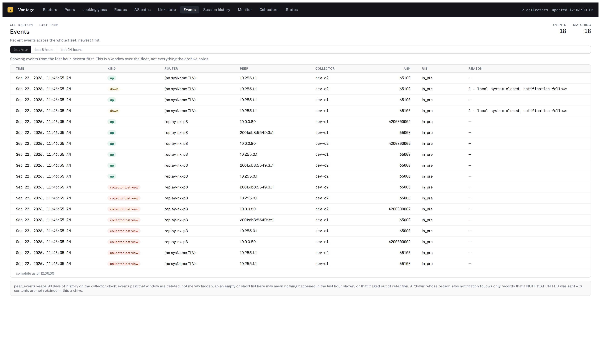

*Events: 18 in the last hour, fleet-wide, each tagged with the collector
that saw it. `down` carries the router's reason; `collector lost view` is
the collector's own blindness and is never folded into it. The footer states
the history retention (90 days by default) so a short list is not misread
as a quiet feed.*

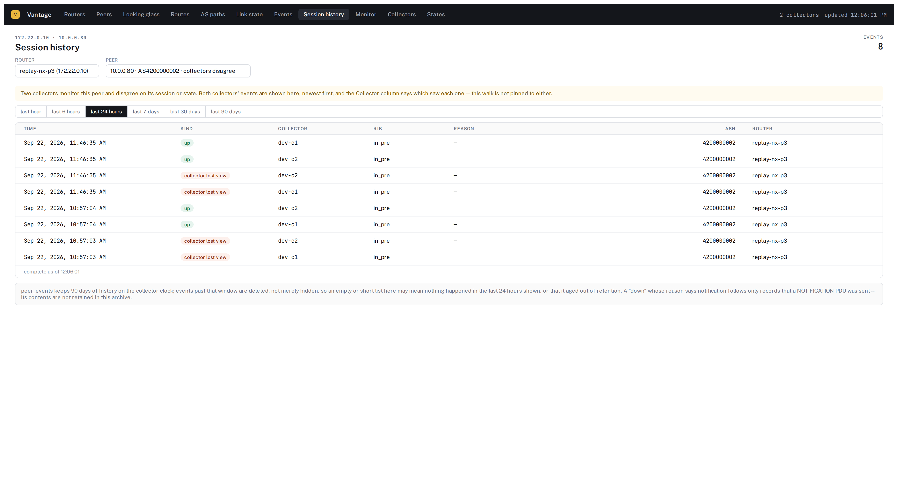

*Session history: one (router, peer) pair's events over a window you choose.
Both collectors' events appear, with the Collector column saying which saw
each — the walk is not pinned to either.*

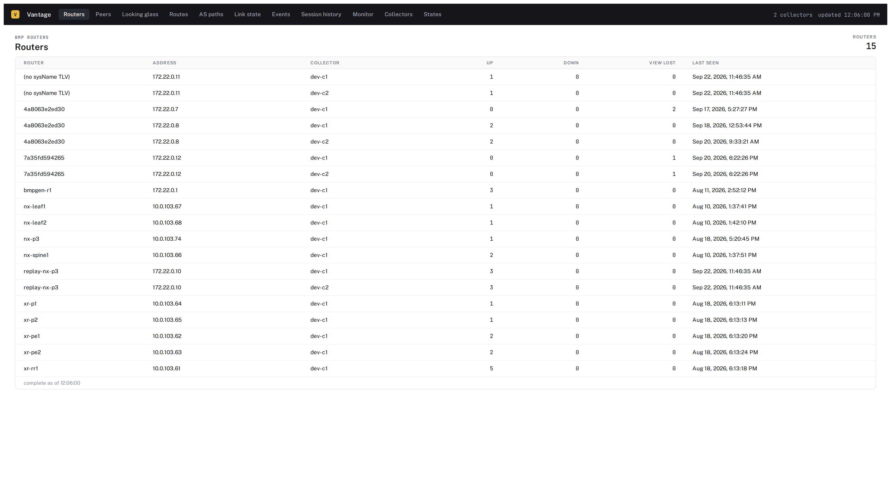

*Routers: 15 routers across 19 (router, collector) rows — four of them
dual-homed to both collectors, which is how the cross-collector counting
above gets exercised for real rather than against fixtures. A router that
sent no sysName TLV is labeled as such rather than given a guessed name.*

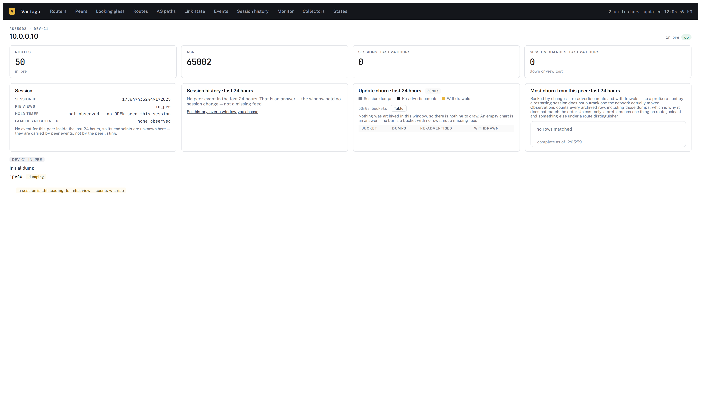

*Peer detail, and the most useful thing in this picture is the empty space.
No peer shown here is both route-rich and session-active, so four panels
have nothing to draw — and each says why: "An empty chart is
an answer — no bar is a bucket with no rows, not a missing feed." A
dashboard that renders zero identically to unknown is a dashboard that
cannot be trusted at 3 a.m.*

## Quickstart

Brings up the whole pipeline in Docker — NATS with JetStream,
`vantage-collector` twice, ClickHouse with the schema applied,
`vantage-writer`, `vantage-api` with the UI embedded, and Grafana — and
replays committed BMP captures into both collectors, so the stack has real
link-state, VPN and EVPN data in it on the first `up`:

```
make fetch-asnames    # optional: AS holder names from RIPE, shown beside AS numbers
docker compose -f docker-compose.dev.yml up --build -d
```

Fetch the names first if you want them. If you skip it, the stack still comes
up and simply shows bare AS numbers. Docker then creates `deploy/dev/asnames`
as an empty root-owned placeholder, so a later `make fetch-asnames` needs
`rmdir deploy/dev/asnames` before it can write there (no `sudo` needed).

Then open **<http://127.0.0.1:9473>** and paste the development token
`dev-token-not-a-secret` when the UI asks. Grafana, with thirteen dashboards
and a ClickHouse datasource already wired in, is on
<http://127.0.0.1:3000>.

To push synthetic traffic at it as well:

```
go run ./cmd/vantage bmpgen -peers 2 -updates 10
```

**The dev stack is for evaluation on a machine you control, not a
deployment target.** NATS, the collectors' metrics and admin ports, the
writer, the API, ClickHouse and Grafana all publish on `127.0.0.1` only. Do
not change those bindings. The two collectors' BMP ports (`11019`, `11119`)
are the exception and listen on `0.0.0.0`, because a BMP listener that
accepts only loopback connections can never hear from a router. The dev
stack's Grafana allows anonymous access to a ClickHouse datasource, so
anyone who can reach its port can run arbitrary SQL.

Health checks, querying ClickHouse directly, and tearing it all down:
[`docs/deploying.md`](docs/deploying.md).

## Deploying it for real

`deploy/helm/vantage` is the Kubernetes path, and it is deliberately
bring-your-own for everything that stores data:

- **ClickHouse is yours.** The chart ships none and has no bundled mode —
  `clickhouse.externalHost` and explicit credentials are required, and a
  render without them fails with a sentence saying so. The chart does still
  apply vantage's own schema.
- **NATS** comes as a subchart: by default three servers, keeping three
  copies of every stream the archive depends on. Or point `nats.externalURL`
  at your own.
- **Grafana is not deployed at all.** The thirteen dashboards in
  `deploy/grafana/` import into whatever instance you already run.

The chart's images default to `ghcr.io/jp2195/vantage-collector`,
`-writer` and `-api`, tagged with the chart's `appVersion`, so a released
chart pulls matching images with no overrides. To run code that is not in
a release, build your own with `make push-images REGISTRY=<your-registry>`
and point `images.*.repository` and `images.*.tag` at them.

Each release also publishes the `vantage` CLI for Linux, macOS and Windows
on the GitHub Releases page, with checksums, SBOMs and signed build
provenance.

An overview, applying the schema by hand, and the AS-holder-name data:
[`docs/deploying.md`](docs/deploying.md). The full chart reference:
[`deploy/helm/README.md`](deploy/helm/README.md).

## Where to go next

- [`docs/architecture.md`](docs/architecture.md) — `vantage-collector`,
  `vantage-writer` and `vantage-api` internals, and the decisions behind
  each
- [`docs/deploying.md`](docs/deploying.md) — the dev stack in full, applying
  the schema, AS holder names, and the Helm chart
- [`docs/operating.md`](docs/operating.md) — daily operation, metrics worth
  alerting on, lag and loss semantics, upgrades
- [`docs/troubleshooting.md`](docs/troubleshooting.md) — symptom-first: a
  peer won't come up, no routes are appearing, writer lag is climbing, a
  screen reads zero
- [`docs/cli.md`](docs/cli.md) — the `vantage` CLI, `vantage debug`, the
  traffic generators, and stream provisioning
- [`docs/grafana.md`](docs/grafana.md) — the thirteen provisioned dashboards
- [`docs/quirks.md`](docs/quirks.md) — the vendor quirk matrix and what each
  parse flag means for a consumer
- [`docs/measurements.md`](docs/measurements.md) — the load tests and query
  cost measurements behind the daemon's limits and defaults
- [`docs/references.md`](docs/references.md) — external specs and
  implementations worth reading

## Development

```
make ui         # build the Vue app into webui/dist (npm + vite; embedded by the api binary)
make dev-api    # rebuild UI + daemon and serve the app on 127.0.0.1:9473
make generate   # buf codegen (needs buf@v1.73.0 + protoc-gen-go@v1.36.12 go-installed into $(go env GOPATH)/bin; see Makefile)
make check      # build every package, vet, unit tests
make test       # full gate: race detector and a live ClickHouse
make ui-test    # the UI test suite
make build      # bin/vantage and the three daemons: bin/vantage-collector, -writer, -api
make fuzz       # parser fuzzers, 30s each
```

`make help` lists every target. CI (`.github/workflows/ci.yml`) runs the Go
build, tests and vet, `gofmt -l` (must be silent), a check that `make
generate`'s output matches what is committed under `schema/`, a check that
the typed UI client matches `api/openapi.yaml`, and a `buf breaking` check
of `proto/` against `git main` — the schema is additive-only by design
(package `vantage.v1`; new fields and messages only, never a renumbered or
removed field). It also runs `make standalone-check`, which fails on a
published file that cites an internal path, a commit SHA or internal process
material; a sentence it flags wrongly is either reworded or allowlisted in
`scripts/citation-allow.txt` (see CONTRIBUTING.md). Separate workflows run
CodeQL over the Go, UI and workflow code and scan the container images for
vulnerabilities.

## License

Copyright © 2026 jp2195.

vantage is licensed under the **Apache License 2.0** — see
[`LICENSE`](LICENSE).

A contribution you intentionally submit is licensed under the same terms, as
section 5 of the license provides; there is no separate agreement to sign.
[`CONTRIBUTING.md`](CONTRIBUTING.md) describes what this project expects of
a change.
